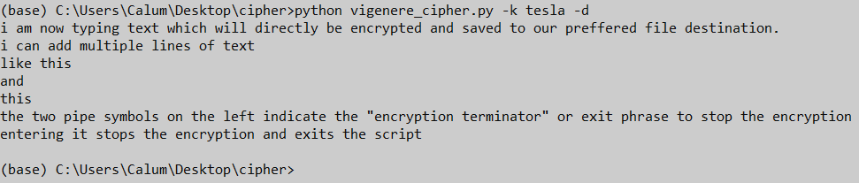

# Vigenere Cypher


## About
A simple command line tool written in python to write and read text which has been encrypted using a standard [vigenere cipher](https://en.wikipedia.org/wiki/Vigen%C3%A8re_cipher).
Text which is encrypted by the user is saved to a local `.txt` file which can then later be accessed and decrypted.
While not encrypted, numbers and other non-alpha characters can be passed for encryption / decryption.

For both encrypting and decrypting, the same user keyword must be passed each time by the user, otherwise the content cannot be retrieved!
For this README, the keyword *tesla* is used however any user keyword can be used

The user default file location and encryption terminator (see Encryption) are specified in the `config.yml` file.


### Encryption
To encrypt a file, the user must specify the key word using the `-k` flag and also set the encrypt flag `-e`.
````
$ python vigenere_cypher.py -k tesla -e
````

The user can then save text to the file by typing into the prompt and pressing `return` to start a new line.
each individual line in the terminal represents an individual line in the encrypted file.

The **Encryption Terminator** is the dual pipe symbol `||` on the left of the terminal and entering it signals the program to stop encrypting text and close the process.
The exact symbol combination can be customised by the user in the `config.yml` file.
To aid memory, the encryption terminator is always the same symbol on the left of the terminal and it must be typed exactly as saved in the `config.yml` file to successfully end and save the encryption.
The encryption terminator is NOT saved to the output file.


### Decryption
As with encryption, here the user must pass the keyword originally used to encrypt the file `-k` and the decryption flag `-d`.
````
$ python vigenere_cypher.py -k tesla -d
````

Here the contents of the default file is read and decrypted using the passed keyword and then printed to the screen.
An important note here is that since the entire file is decrypted using the singular keyword, it is not possible to encrypt different sections of the file with different keywords.
Multiple files can be created however, each one with a different keywords if so desired.
Another note is that this version does not currently support the encryption / decryption of capitalised letters.


### Using Alternate Files
While only one default file location is saved in the `config.yml`, it is possible to pass a file location as an argument with the `-f` flag.
````
$ python vigenere_cypher.py -k motor -e -f alternate_file.txt
````

If this file is to be decrypted later then the file location and keyword must be specified again unless the default file location is altered in the `config.yml`.


## Requirements / Installation
This project makes use of the standard python 3 library so should be good to just download and plug away.

The `vigenere_cipher.py` and `config.yml` files must be in the same directory when the program is run.


## Disclaimer
This was inspired by the amazing film [The Prestige](https://www.imdb.com/title/tt0482571/) by Christopher Nolan where the protagonist keeps a written diary encrypted with a vigenere cipher.

All I have done here is simplify the encryption / decryption procedure itself and so have not made any further efforts regarding the security of the `.txt` file the encryptions are saved to.
This means that if someone gained access to your computer they could look through your terminal history to learn your keyword.
Alternatively they could just open the encrypted `.txt` file and delete the contents.

There are ways of fixing the first problem by building in commands to terminal terminal history but wanted this to be "clean" at the start.
